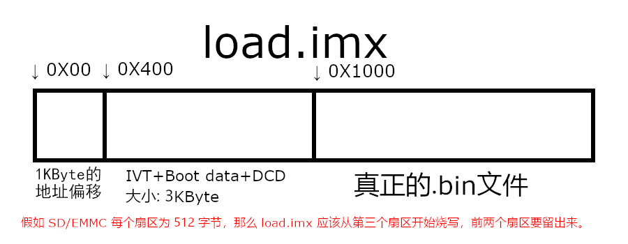

# VIM

安装 VIM

```shell
sudo apt-get install vim
```

配置 VIM

```shell
sudo vim /etc/vim/vimrc
```

末尾添加下面的代码
```shell
set ts=4
set nu
set noexpandtab
```


# FTP 服务(文件互传)

安装 FTP 服务

```shell
sudo apt-get install vsftpd
```

配置 FTP 服务

```shell
sudo vim /etc/vsftpd.conf
```

删除 write_enable=YES 前面的的 '#'

重启FTP 服务

```shell
sudo /etc/init.d/vsftpd restart  
```


# NFS 服务开启

```shell
sudo apt-get install nfs-kernel-server rpcbind
```

配置 NFS

```shell
sudo vi /etc/exports
```

在最后添加以下内容：

```tex
/home/zuozhongkai/linux/nfs *(rw,sync,no_root_squash) 
```

重启NFS 服务

```shell
sudo /etc/init.d/nfs-kernel-server restart
```


# SSH 服务开启  

```shell
sudo apt-get install openssh-server
```


# 交叉编译器安装

将 [gcc-linaro-4.9.4-2017.01-x86_64_arm-linux-gnueabihf.tar.xz](主文件夹\linux\tool\gcc-linaro-4.9.4-2017.01-x86_64_arm-linux-gnueabihf.tar.xz) 传给Ubuntu

Ubuntu 中创建目录

```shell
sudo mkdir /usr/local/arm
```


将交叉编译器复制到/usr/local/arm 中

```shell
sudo cp gcc-linaro-4.9.4-2017.01-x86_64_arm-linux-gnueabihf.tar.xz /usr/local/arm/ -f  
```

```shell
cd /usr/local/arm
```


解压交叉编译器

```shell
sudo tar -vxf gcc-linaro-4.9.4-2017.01-x86_64_arm-linux-gnueabihf.tar.xz
```


修改环境变量，使用 VIM 打开/etc/profile 文件

```shell
sudo vim /etc/profile
```


在末尾输入如下内容

```tex
export PATH=$PATH:/usr/local/arm/gcc-linaro-4.9.4-2017.01-x86_64_arm-linux-gnueabihf/bin
export ALSA_CONFIG_PATH=/usr/share/arm-alsa/alsa.conf
```


保存退出，重启 Ubuntu 系统


交叉编译器验证

```shell
arm-linux-gnueabihf-gcc -v
```


# 应用无法升级更新

```shell
sudo snap refresh snap-store
```


# 安装第三方软件包管理器

 ```shell
 sudo apt install gdebi
 ```


# U-Boot 图形化配置

```shell
sudo apt-get install build-essential 
sudo apt-get install libncurses5-dev 
```


# 查询系统存储设备和烧录程序

```shell
ls /dev/sd* #显示存储设备

chmod 777 imxdownload
./imxdownload *.bin /dev/sdb #烧录代码

sudo rm -rf /dev/sdb #删除sdb节点
```


# load.imx 在 DDR 中的位置


# load.imx 在 MMC 中的位置



# 启动方式选择 

|  1   |  2   |  3   |  4   |  5   |  6   |  7   |  8   |              启动设备              |
| :--: | :--: | :--: | :--: | :--: | :--: | :--: | :--: | :--------------------------------: |
|  0   |  1   |  x   |  x   |  x   |  x   |  x   |  x   | 串行下载，可以通过USB 烧写镜像文件 |
|  1   |  0   |  0   |  0   |  0   |  0   |  1   |  0   |             SD 卡启动              |
|  1   |  0   |  1   |  0   |  0   |  1   |  1   |  0   |             EMMC 启动              |
|  1   |  0   |  0   |  0   |  1   |  0   |  0   |  1   |          NAND FLASH 启动           |


# U-Boot

## 编译 U-Boot

创建脚本文件 mx6ull_alientek_emmc.sh

在里面输入如下内容: 

```shell
#!/bin/bash
make ARCH=arm CROSS_COMPILE=arm-linux-gnueabihf- distclean
make ARCH=arm CROSS_COMPILE=arm-linux-gnueabihf- mx6ull_14x14_ddr512_emmc_defconfig
make V=1 ARCH=arm CROSS_COMPILE=arm-linux-gnueabihf- -j6
```

给予 mx6ull_alientek_emmc.sh 文件可执行权限，然后就可以使用这个 shell 脚本文件来编译uboot

```shell
chmod 777 mx6ull_alientek_emmc.sh
./mx6ull_alientek_emmc.sh
```

## U-Boot 烧写

使用 imxdownload 软件烧写，命令如 下: 

```shell
chmod 777 imxdownload
./imxdownload u-boot.bin /dev/sdb #烧录代码
```

# 搭建TFTP

安装 tftp-hpa 和tftpd-hpa，命令如下：

```shell
sudo apt-get install tftp-hpa tftpd-hpa
sudo apt-get install xinetd
```

创建一个文件夹

```shell
mkdir /home/zuozhongkai/linux/tftpboot
chmod 777 /home/zuozhongkai/linux/tftpboot
```

配置tftp

```shell
sudo vim /etc/xinetd.d/tftp
```

输入如下内容

```c
server tftp
{
	socket_type = dgram
	protocol = udp
	wait = yes
	user = root
	server = /usr/sbin/in.tftpd
	server_args = -s /home/zuozhongkai/linux/tftpboot/
	disable = no
	per_source = 11
	cps = 100 2
	flags = IPv4
}
```

 启动 tftp 服务，命令如下： 

```shell
sudo service tftpd-hpa start
```

打开/etc/default/tftpd-hpa 文件

```shell
sudo vim /etc/default/tftpd-hpa
```

替换为以下内容

```shell
# /etc/default/tftpd-hpa

TFTP_USERNAME="tftp"
TFTP_DIRECTORY="/home/zuozhongkai/linux/tftpboot"
TFTP_ADDRESS=":69" 
TFTP_OPTIONS="-l -c -s"
```

重启 tftp 服务器

```shell
sudo service tftpd-hpa restart
```

指令格式

```shell
tftp 80800000 192.168.x.x:zImage
```

# 挂载根文件系统

## TODO


通过MobaXterm在uboot里输入

```shell
setenv bootargs 'console=ttymxc0,115200 root=/dev/nfs nfsroot=192.168.1.111:/home/zuozhongkai/linux/nfs/rootfs,v3,proto=tcp rw ip=192.168.1.184:192.168.1.111:192.168.1.1:255.255.255.0::eth0:off'
setenv ipaddr 192.168.1.184
setenv ethaddr b8:ae:1d:01:00:00
setenv gatewayip 192.168.1.1
setenv netmask 255.255.255.0
setenv serverip 192.168.1.111
saveenv
```


